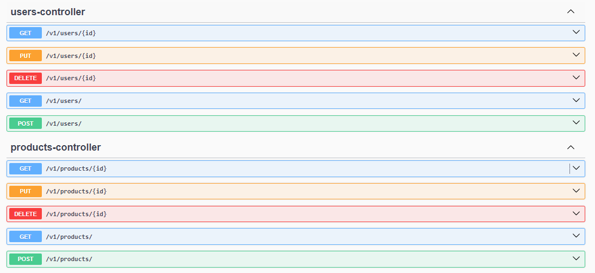

## Codelab 🧪 Implementing a REST API Service

Implement different REST API Services to support a store products management system, implementing each CRUD Operation
with Pagination for each service (Users and Products):

- Create
- Read
- Update
- Delete

👉 Aim to reach the [Glory of Rest](https://martinfowler.com/articles/richardsonMaturityModel.html).

👉 Use the correct methods and status codes
of [HTTP Protocol](https://developer.mozilla.org/en-US/docs/Web/HTTP/Basics_of_HTTP).

👉 It should have at least have
the [Level 2 - HTTP Verbs of Richardson Maturity Model](https://martinfowler.com/articles/richardsonMaturityModel.html).

**Programming Language**:- Java.

**Framework:** Spring Boot.

**Database:** MongoDB.

**Learning Objectives**

- Use the Richardson Maturity Model to implement a REST API Service.
- Implement a REST API Service using Spring Boot.
- Implement CRUD Operations.

## Detail Orientation 🤹🏽

Good code is about details. Follow each step carefully and make sure your code is clean and readable.

**Main Topics**

* Microservices.
* REST API.
* MongoDB.
* Java.
* Spring Boot.

## Codelab 🧪

🗣️ "I hear and I forget I see and I remember I do and I understand." Confucius

## Getting Started

These instructions will get you a copy of the project up and running on your local machine for development and testing purposes.

### Installing

To run the project, follow the steps below

Clone the repository

```bash
git clone https://github.com/An6ie02/IETI-Swagger.git
cd IETI-Swagger
```

Run the project

```bash
gradlew bootRun
```

For viewing the API documentation, go to the following URL

```bash
http://localhost:8080/swagger-ui/index.html
```

## Running the tests

Run the tests using the following command

```bash
gradlew test
```

## Authors

* **Ada-School** - *Initial work* - [Ada-School Repository](https://github.com/ada-school/spring-boot-java-assignments.git)
* **Angie Mojica** - *API Controllers and Documentation* - [An6ie02](https://github.com/An6ie02)

## License

This project is licensed under the MIT License - see the [LICENSE](LICENSE) file for details

